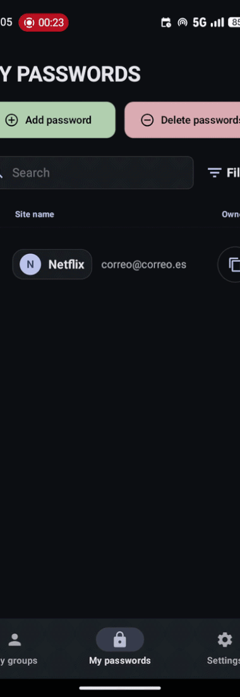

# LockedIn

**LockedIn** is an offline-first password manager developed during HackUDC 2026 (only 36h) that makes advanced encryption accessible through a seamless and intuitive user experience. It automates complex asymmetric cryptography for secure group sharing, keeping your data **protected** without any technical friction.



---

## Features

- **Offline Password Vault**: store passwords locally with AES-256-GCM encryption and a device-side master key.
- **Auto Complete and Auto Store**: prompts an option to complete or store a password depending on the case.
- **End-to-End Encrypted Sharing**: share passwords between users using asymmetric cryptography (RSA) and a Symmetric Group Key (SGK).
- **Zero-Knowledge Backend**: the server stores only hashed identifiers and encrypted blobs; it never has access to plaintext secrets.
- **Group Management**: create groups, invite members by phone number, and share credentials securely.
- **Password Generator**: generate strong, customizable passwords on-device.
- **Modern Material 3 UI**: clean Jetpack Compose interface with dark/light theme support.
- **Docker-Ready Backend**: one-command deployment with Docker Compose (FastAPI + PostgreSQL).

### To Do Features

- **Synchronize mobile contacts**: make an easy way to add known people to your passwords group.
- **2FA to verify the user**: receive an SMS on the number that you introduce to verify that is your number.
- **Recovery cases**: a method to backup and recover all your cloud information (local is unrecoverable for security reasons)

---

## How Does It Work?

> [!WARNING]
> Its an MVP proyect with unfinished features

### Registration

1. The user enters their phone number and master key.
2. The app generates an RSA key pair and a random remote password.
3. The private key and master key are stored in secure on-device storage (`EncryptedSharedPreferences`).
4. The remote password is hashed with **SHA-256** on the client and sent to the server along with the phone number and public key.
5. The server hashes the phone number with **HMAC-SHA-256** (+ pepper) for O(1) lookup, and the password hash with **Argon2id** (+ salt + separate pepper) for storage.

### Password Sharing (SGK Flow)

1. **Create a group**: the creator generates a random AES-256 **Symmetric Group Key (SGK)**, encrypts it with their own public key, and uploads it.
2. **Invite a member**: the creator fetches the invitee's public key from the server, encrypts the SGK with it, and uploads the encrypted copy.
3. **Join the group**: the invitee downloads the encrypted SGK and decrypts it with their private key.
4. **Share a password**: any member encrypts the password with the SGK (AES-256-GCM) and uploads the ciphertext. Other members decrypt it locally with the same SGK.

For more details, see the [encryption documentation](media/cifrado.md) and the sequence diagrams ([registration](media/registro.png), [SGK flow](media/sgk.png)).

---

## Architecture

```
LockedIn/          Android app (Kotlin, Jetpack Compose, Room, MVVM)
backend/           REST API (FastAPI, SQLAlchemy, asyncpg, PostgreSQL)
  app/
    core/          Config, database, security helpers
    models/        SQLAlchemy models
    routers/       Auth & groups endpoints
    schemas/       Pydantic request/response schemas
```

| Component | Tech |
|---|---|
| Android app | Kotlin · Jetpack Compose · Room · AES-256-GCM · RSA |
| Backend API | Python · FastAPI · SQLAlchemy (async) · Argon2id · JWT |
| Database | PostgreSQL 16 |
| Containerisation | Docker · Docker Compose |

---

## Deployment

### Backend

The backend runs as two Docker containers (API + PostgreSQL).

```bash
cd backend

# Create a .env file with required secrets (see backend/README.md)
cp .env.example .env   # edit with your values

# Start the services
docker compose up -d
```

The API will be available at `http://localhost:8000`. Full endpoint documentation is in [backend/DocAPI.md](backend/DocAPI.md).

### Android App

1. Download the latest APK from the **Releases** page and install it on your device.
2. Alternatively, open the `LockedIn/` directory in Android Studio and build from source:

```bash
cd LockedIn
./gradlew assembleDebug
```

> **Note:** The backend URL is currently hardcoded in the app. Update it in the source before building if you host your own instance.

---

## How to Use

1. **Register**: open the app, enter your phone number and choose a master key.
2. **Add passwords**: tap the **+** button to create entries (title, username, password, optional URL/notes). You also can use the autofill popup in password fields. Your data is encrypted and stored locally.
3. **Create a group**: go to the groups section and create a new group to start sharing passwords.
4. **Invite members**: add other registered users to your group by their phone number.
5. **Share a password**: add a password entry to the group. It will be end-to-end encrypted with the group's SGK so all members can decrypt it.
> **Note:**: the phone number is currently hardcoded in the app.

---

## Contributions

You can find all the necessary information in the [CONTRIBUTING.md](CONTRIBUTING.md) document. Please always follow the [Code of Conduct](CODE_OF_CONDUCT.md).

---

## Licences

- Icons and fonts sourced from [Google Fonts](https://fonts.google.com) — Open Source (Apache License 2.0 / SIL OFL).

## Our Licence

This project is shared under the **Apache License 2.0**. See the [LICENSE](LICENSE) file for details.
